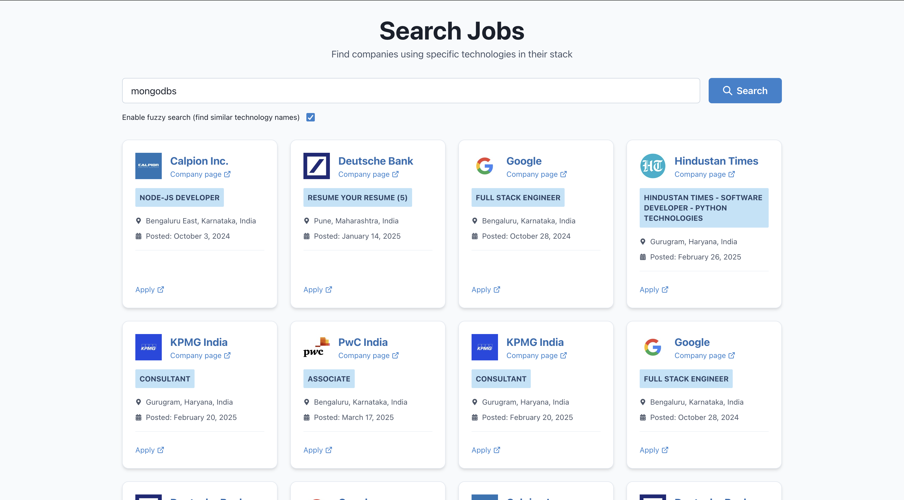
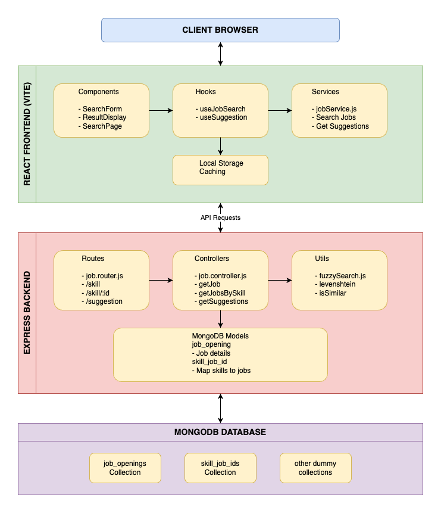

# Job Technology Matcher

A web application that helps users find job opportunities based on specific technologies. The application uses fuzzy search capabilities to match technology names even when there are typos or similar terms.



## Features

- **Technology-based Job Search**: Find jobs requiring specific programming languages, frameworks, or tools
- **Fuzzy Search**: Search works even with typos or related terms thanks to Levenshtein distance algorithm
- **Auto-suggestions**: Get technology suggestions as you type
- **Responsive Design**: Works on desktop and mobile devices
- **Client-side Caching**: Reduces redundant API calls and improves performance

## Architecture

The application uses a modern full-stack architecture with React frontend and Express backend.



### Architecture Components

#### 1. Frontend (React + Vite)

- **Components Layer**:
  - `SearchForm.jsx`: Provides search interface with autocomplete suggestions
  - `ResultsDisplay.jsx`: Shows job listings with pagination
  - `SearchPage.jsx`: Main page coordinating search functionality

- **Hooks Layer**:
  - `useJobSearch.js`: Custom hook using React Query for data fetching
  - `useSuggestions.js`: Hook for fetching technology suggestions

- **Services Layer**:
  - `jobService.js`: API communication and data formatting

- **Caching Layer**:
  - `storage.js`: Client-side caching to reduce API calls

#### 2. Backend (Express.js)

- **Routing Layer**:
  - `job.router.js`: Defines API endpoints for job search

- **Controller Layer**:
  - `job.controller.js`: Implements business logic for endpoints

- **Utility Layer**:
  - `fuzzySearch.js`: Implements Levenshtein distance algorithm

- **Model Layer**:
  - `job_opening.model.js`: Schema for job listings
  - `skill_job_id.model.js`: Maps skills to job IDs for efficient searches

#### 3. Database (MongoDB)

- `job_openings` collection: Stores detailed job information
- `skill_job_ids` collection: Maps skills to relevant job IDs

## Getting Started

### Prerequisites

- Node.js (v14+)
- npm or yarn
- Backend server running (see backend README)

### Installation

1. Clone the repository:
   ```
   git clone <repository-url>
   cd job-matcher
   ```

2. Install dependencies:
   ```
   npm install
   ```

3. Configure the application:
   - Update `src/config/constants.js` with your backend URL

4. Start the development server:
   ```
   npm run dev
   ```

5. Open your browser to `http://localhost:5173`

## Using the Application

1. Type a technology name in the search box
2. Optional: Select an auto-suggested technology 
3. Toggle fuzzy search on/off based on your preference
4. Browse through job listings using pagination
5. Click on job cards to view details or apply links

## How Fuzzy Search Works

The application implements the Levenshtein distance algorithm to find similar technology names. This allows users to find relevant jobs even when:

- There are typos in the search term
- Different variations of a technology name are used (e.g., "JavaScript" vs "JS")
- Similar technologies are available (e.g., searching for "React" might also show "React Native" jobs)

The similarity threshold is configurable and defaults to 0.3 (30% similarity).

## Build for Production
